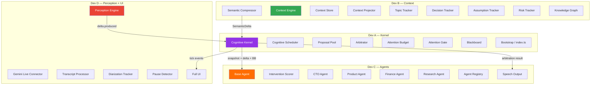
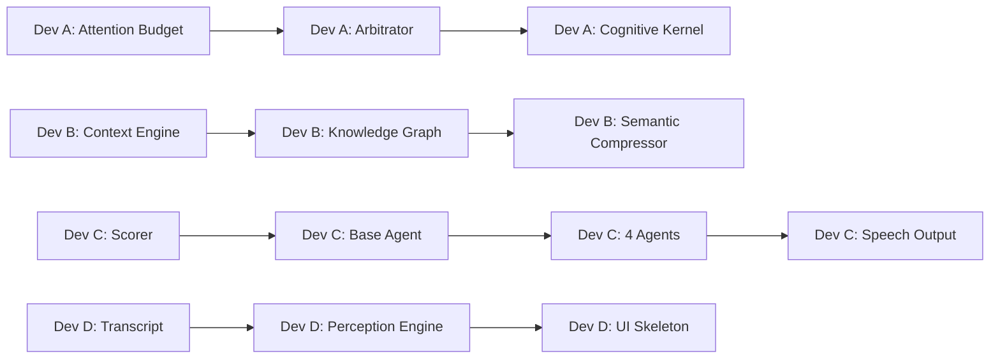
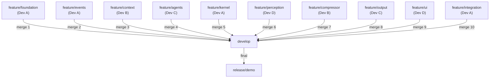

# Conclave — Development Plan

**Version:** 1.0
**Date:** July 11, 2026
**Team Size:** 4 developers
**Target:** Google DeepMind Bangalore Hackathon

---

## Table of Contents

1. [Team Structure & Ownership](#1-team-structure--ownership)
2. [Git Strategy](#2-git-strategy)
3. [Coding Conventions](#3-coding-conventions)
4. [Interface Contracts (Must Complete First)](#4-interface-contracts-must-complete-first)
5. [Development Timeline](#5-development-timeline)
6. [Milestone Definitions](#6-milestone-definitions)
7. [Integration Checkpoints](#7-integration-checkpoints)
8. [Daily Development Plan](#8-daily-development-plan)
9. [Testing Strategy](#9-testing-strategy)
10. [Merge Strategy](#10-merge-strategy)
11. [Final Integration Sequence](#11-final-integration-sequence)
12. [Risk Contingency Plan](#12-risk-contingency-plan)

---

## 1. Team Structure & Ownership

### Developer Assignments

| Developer | Alias | Primary Ownership | Secondary Ownership |
|---|---|---|---|
| **Dev A** | **Kernel** | Cognitive Kernel, Arbitrator, Attention Budget, Attention Gate, Blackboard, Proposal Pool | Integration bootstrap (`src/index.ts`) |
| **Dev B** | **Context** | Context Engine, Knowledge Graph, Semantic Compressor | Decision Graph generation, Meeting Record export |
| **Dev C** | **Agents** | Agent framework (base-agent, intervention-scorer), all 4 agents, Agent Registry | Speech Output (response-formatter, speech-synthesizer) |
| **Dev D** | **Perception+UI** | Perception Engine, Gemini Live Connector, Transcript Processor, Diarization, Pause Detector | Full UI (all components, styling, WebSocket client) |

### Ownership Rationale



### Why This Split Works

| Principle | How It's Achieved |
|---|---|
| **Minimize file conflicts** | Each developer owns a distinct `src/` subdirectory. No two developers edit the same file. |
| **Maximize parallelism** | After interfaces are agreed upon (Day 0.5), all developers can code independently. |
| **Clear integration boundary** | Dev A (Kernel) is the integration point. Kernel consumes Context + Agents + Perception. |
| **UI specialist** | Dev D owns both perception (input) and UI (output) — they understand the full user-facing experience. |
| **Agent specialist** | Dev C owns the entire agent lifecycle from evaluation to speech, including the scorer that determines intervention quality. |

---

## 2. Git Strategy

### Branch Model

```
main
  │
  ├── develop                    ← integration branch (always buildable)
  │   │
  │   ├── feature/foundation     ← Dev A: Phase 1 (shared by all initially)
  │   │
  │   ├── feature/events         ← Dev A: Event Bus
  │   ├── feature/context        ← Dev B: Context Engine + Knowledge Graph
  │   ├── feature/agents         ← Dev C: Agent framework + 4 agents
  │   ├── feature/kernel         ← Dev A: Cognitive Kernel
  │   ├── feature/perception     ← Dev D: Perception Engine
  │   ├── feature/compressor     ← Dev B: Semantic Compressor
  │   ├── feature/output         ← Dev C: Speech Output
  │   ├── feature/ui             ← Dev D: User Interface
  │   └── feature/integration    ← Dev A: Bootstrap + wiring
  │
  └── release/demo               ← final demo-ready branch
```

### Branch Rules

| Rule | Details |
|---|---|
| `main` | Never commit directly. Only merge from `release/demo`. |
| `develop` | Integration branch. Must always compile (`npx tsc --noEmit`). |
| `feature/*` | Individual feature branches. Developer owns their branch. |
| Merge direction | `feature/* → develop → release/demo → main` |
| PR reviews | All merges to `develop` require at least one approval from another developer. |
| Conflict resolution | If two features conflict, the developer merging second resolves the conflict. |

### Commit Convention

```
<type>(<scope>): <subject>

Types: feat, fix, refactor, test, docs, chore
Scopes: events, context, kernel, agents, perception, output, ui, shared, config

Examples:
  feat(kernel): implement Cognitive Tick loop
  feat(agents): add CTO agent with structured prompt
  fix(context): freeze snapshot correctly
  test(kernel): add arbitration rule tests
  docs(readme): add architecture diagram
```

---

## 3. Coding Conventions

### TypeScript Rules

| Rule | Enforcement |
|---|---|
| Strict mode | `"strict": true` in tsconfig.json |
| No `any` | ESLint rule: `@typescript-eslint/no-explicit-any: error` |
| No circular dependencies | ESLint plugin: `eslint-plugin-import` with `no-cycle` rule |
| Interface prefix | All interfaces start with `I`: `IContextEngine`, `IEventBus` |
| Enum values | UPPER_SNAKE_CASE: `EventType.SPEAKER_STARTED` |
| Type exports | Every module exports its interfaces from `interfaces.ts` |
| Barrel exports | Every module has an `index.ts` that re-exports public API |

### File Organization

| Rule | Details |
|---|---|
| One class per file | Each class/implementation gets its own file |
| Max file length | 300 lines (soft limit). Extract if exceeding. |
| Interface file | Every module has `interfaces.ts` as the first file created |
| Naming | `kebab-case` for files: `cognitive-kernel.ts`, `attention-budget.ts` |
| Imports | Use path aliases: `import { IEventBus } from '@events/interfaces'` |

### Code Style

```typescript
// ✅ Good: Interface-first, typed, documented
interface IAttentionBudget {
  /** Check if the budget allows an interruption */
  canInterrupt(): boolean;

  /** Consume budget units after a granted interruption */
  consume(cost: number): void;

  /** Replenish budget based on elapsed time */
  replenish(elapsedMs: number): void;

  /** Get current budget state for UI and arbitration */
  getState(): AttentionBudgetState;
}

// ✅ Good: Implementation is separate, depends on interface
class AttentionBudget implements IAttentionBudget {
  private remaining: number;
  private config: AttentionBudgetConfig;

  constructor(config: AttentionBudgetConfig) {
    this.remaining = config.initialBudget;
    this.config = config;
  }

  canInterrupt(): boolean {
    return this.remaining > this.config.minThreshold && !this.isInCooldown;
  }
  // ...
}

// ❌ Bad: God class, mixed concerns, any types
class MeetingManager {
  handleEverything(data: any): any { /* ... */ }
}
```

### Error Handling

```typescript
// All modules use custom errors from shared/errors.ts
class ConclaveError extends Error {
  constructor(
    message: string,
    public readonly module: string,
    public readonly code: string,
  ) {
    super(`[${module}] ${message}`);
  }
}

// Agents: never throw on LLM failures, return null proposal
// Kernel: catch agent errors, continue tick with remaining agents
// Perception: catch Gemini errors, retry with backoff, log
```

---

## 4. Interface Contracts (Must Complete First)

> [!IMPORTANT]
> **All interface files MUST be completed and agreed upon before parallel implementation begins.** This is the single most important coordination step. Without stable interfaces, parallel development will cause integration nightmares.

### Interface Creation Responsibility

| Interface File | Created By | Reviewed By | Consumed By |
|---|---|---|---|
| `src/shared/types.ts` | Dev A | All | All |
| `src/events/interfaces.ts` | Dev A | All | All |
| `src/events/event-types.ts` | Dev A | All | All |
| `src/events/event-schema.ts` | Dev A | All | All |
| `src/context/interfaces.ts` | Dev B | Dev A | Dev A (Kernel), Dev D (UI) |
| `src/kernel/interfaces.ts` | Dev A | Dev B, Dev C | Dev B, Dev C, Dev D |
| `src/agents/interfaces.ts` | Dev C | Dev A | Dev A (Kernel) |
| `src/output/interfaces.ts` | Dev C | Dev A | Dev A (Kernel) |
| `src/perception/interfaces.ts` | Dev D | Dev B | Dev A (Kernel), Dev B (Compressor) |
| `src/knowledge/interfaces.ts` | Dev B | Dev A | Dev A (Kernel) |

### Interface Freeze Protocol

1. Dev A creates all shared types, event types, and event schemas
2. All developers review and propose changes
3. All interface files are created with full method signatures, parameter types, and return types
4. **Interface freeze**: After agreement, interfaces become stable. Changes require team-wide notification.
5. Implementation begins

### Critical Interface Dependencies

```
These interfaces MUST be stable before the consuming module can begin implementation:

IEventBus ──────────── needed by ──→ Context, Kernel, Perception, UI
IContextEngine ─────── needed by ──→ Kernel
IStakeholderAgent ──── needed by ──→ Kernel (Cognitive Scheduler)
ISemanticCompressor ── needed by ──→ Perception Engine
ICognitiveBlackboard ─ needed by ──→ Kernel
IKnowledgeGraph ────── needed by ──→ Kernel
ISpeechOutput ──────── needed by ──→ Kernel
```

---

## 5. Development Timeline

### Overview

```mermaid
gantt
    title Conclave Development Timeline
    dateFormat  HH:mm
    axisFormat  %H:%M

    section Phase 0
    Interface contracts (all devs)     :p0, 00:00, 2h

    section Phase 1
    Foundation - types + events (Dev A) :p1a, after p0, 2h
    Foundation review (all devs)        :p1r, after p1a, 30m

    section Phase 2-3 (Parallel)
    Context Engine (Dev B)              :p2, after p1r, 4h
    Semantic Compressor (Dev B)         :p2b, after p2, 2h
    Agent framework (Dev C)            :p3a, after p1r, 3h
    4 Agents (Dev C)                   :p3b, after p3a, 3h
    Speech Output (Dev C)             :p3c, after p3b, 1h
    Perception Engine (Dev D)          :p5a, after p1r, 4h
    UI Foundation (Dev D)              :p6a, after p5a, 1h

    section Phase 4
    Cognitive Kernel (Dev A)            :p4, after p1r, 6h
    Blackboard (Dev A)                  :p4b, after p4, 1h

    section Phase 5-6 (Parallel)
    UI Components (Dev D)               :p6b, after p6a, 5h
    UI Polish (Dev D)                   :p6c, after p6b, 2h

    section Phase 7
    Integration (Dev A)                  :p7, after p4b, 3h
    End-to-end testing (all)             :p7t, after p7, 2h
    Demo prep (all)                      :p7d, after p7t, 1h
```



---

## 6. Milestone Definitions

### M0: Interface Contract (All developers)

**Time:** First 2 hours
**Objective:** All interface files created, reviewed, and frozen.

| Deliverable | Owner | Status Indicator |
|---|---|---|
| `src/shared/types.ts` — all types | Dev A | Compiles |
| `src/events/interfaces.ts` + `event-types.ts` + `event-schema.ts` | Dev A | Compiles |
| `src/context/interfaces.ts` | Dev B | Compiles |
| `src/kernel/interfaces.ts` | Dev A | Compiles |
| `src/agents/interfaces.ts` | Dev C | Compiles |
| `src/perception/interfaces.ts` | Dev D | Compiles |
| `src/output/interfaces.ts` | Dev C | Compiles |
| `src/knowledge/interfaces.ts` | Dev B | Compiles |

**Gate:** `npx tsc --noEmit` passes. All developers sign off on interfaces.

---

### M1: Foundation Complete (Dev A)

**Time:** +2 hours after M0
**Objective:** Project compiles, event bus works, shared utilities ready.

| Deliverable | Owner |
|---|---|
| `package.json` with all dependencies | Dev A |
| `tsconfig.json` with path aliases | Dev A |
| `.eslintrc.json` | Dev A |
| `src/shared/` — all utility files | Dev A |
| `src/events/event-bus.ts` — working implementation | Dev A |
| Unit tests for EventBus and similarity | Dev A |

**Gate:** EventBus unit tests pass. All shared utilities importable.

---

### M2: Vertical Slice — Context (Dev B)

**Time:** +4 hours after M1
**Objective:** Context Engine can ingest a `SemanticDelta` and produce a `ContextSnapshot` with populated trackers.

| Deliverable | Owner |
|---|---|
| `src/context/` — all files | Dev B |
| `src/knowledge/` — all files | Dev B |
| Unit tests for Context Engine, all trackers, Context Projector | Dev B |

**Gate:** Can call `contextEngine.handleDelta(mockDelta)` → `contextEngine.getSnapshot()` returns populated snapshot. Snapshot is frozen.

---

### M3: Vertical Slice — Agents (Dev C)

**Time:** +6 hours after M1
**Objective:** Agent framework complete. All 4 agents can evaluate a mock `ContextSnapshot + SemanticDelta + BlackboardState` and return `AgentResult`.

| Deliverable | Owner |
|---|---|
| `src/agents/` — all files | Dev C |
| `src/output/` — all files | Dev C |
| Unit tests for InterventionScorer, BaseAgent, AgentRegistry | Dev C |

**Gate:** Can call `agent.evaluate(mockSnapshot, mockDelta, mockBlackboard)` → receives `AgentResult` with proposal or null + blackboard entries.

---

### M4: Vertical Slice — Kernel (Dev A)

**Time:** +7 hours after M1
**Objective:** Cognitive Kernel can execute a full tick with mocked context and agents.

| Deliverable | Owner |
|---|---|
| `src/kernel/` — all files | Dev A |
| Unit tests for Arbitrator, Attention Budget, Blackboard | Dev A |
| Integration test: full cognitive tick with mocks | Dev A |

**Gate:** Full tick executes: delta → context update → snapshot → blackboard → dispatch → proposals → arbitration → result. Tick completes in < 1 second with mocks.

---

### M5: Vertical Slice — Perception (Dev D)

**Time:** +4 hours after M1
**Objective:** Perception Engine can connect to Gemini Live (or mock) and produce `TranscriptSegment` objects. Pause detection works.

| Deliverable | Owner |
|---|---|
| `src/perception/` — all files except `semantic-compressor.ts` | Dev D |
| Unit tests for pause detection, transcript processing | Dev D |

**Gate:** Perception Engine produces `TranscriptSegment` from audio input (or mock). Pause detector classifies pauses correctly.

---

### M5b: Semantic Compressor (Dev B)

**Time:** +2 hours after M2
**Objective:** Semantic Compressor takes transcript text and returns `SemanticDelta` with structured `SemanticUnit[]`.

| Deliverable | Owner |
|---|---|
| `src/perception/semantic-compressor.ts` | Dev B |
| Unit tests with mocked Gemini responses | Dev B |

**Gate:** Compressor converts "We should use Kubernetes because our traffic will exceed 100k users" into `[{type: "proposal", ...}, {type: "assumption", ...}]`.

**Note:** This file lives in `src/perception/` but is authored by Dev B because it involves Gemini structured output prompting, which is the same skill used for Context Engine. Dev D integrates it into the Perception Engine.

---

### M6: UI Functional (Dev D)

**Time:** +5 hours after M5
**Objective:** All UI panels render with mock data. WebSocket client connects.

| Deliverable | Owner |
|---|---|
| `src/ui/` — all files | Dev D |
| Attention Budget gauge animates | Dev D |
| Blackboard panel shows entries | Dev D |
| Stakeholder panel shows status transitions | Dev D |

**Gate:** Opening the UI in a browser shows all panels populated with mock data. Attention Budget gauge animates on click. Dark theme renders correctly.

---

### M7: Integration (Dev A, all developers support)

**Time:** +3 hours after M4 + M5b
**Objective:** Full system works end-to-end.

| Deliverable | Owner |
|---|---|
| `src/index.ts` — bootstrap | Dev A |
| `src/config.ts` — configuration | Dev A |
| WebSocket server forwarding events to UI | Dev A + Dev D |
| End-to-end integration tests | All |

**Gate:** Speaking into microphone → transcript appears → semantic compression → context updates → agents evaluate → arbitration → speech output. UI reflects all state changes.

---

### M8: Demo Ready (All developers)

**Time:** +2 hours after M7
**Objective:** Polished, demo-ready system.

| Deliverable | Owner |
|---|---|
| Demo script rehearsed | All |
| Fallback mock data for demo failure | Dev D |
| README updated with final architecture | Dev A |
| Bug fixes | All |

**Gate:** Full demo runs without errors for 10 minutes.

---

## 7. Integration Checkpoints

These are mandatory synchronization points where all developers verify their code works together.

### Checkpoint 1: "Types Compile" (After M0)

**When:** After interface contract is complete
**What:** All developers pull `develop`, verify their IDE shows zero type errors
**Who:** All 4 developers
**Duration:** 15 minutes

```bash
git pull origin develop
npx tsc --noEmit
# Must pass with zero errors
```

---

### Checkpoint 2: "Events Flow" (After M1)

**When:** After Foundation is merged to `develop`
**What:** Every developer verifies they can import types and publish/subscribe to events
**Who:** All 4 developers
**Duration:** 15 minutes

```bash
git pull origin develop
# In each module's test file:
import { EventBus } from '@events';
import { EventType } from '@events/event-types';
# Verify publish + subscribe works
```

---

### Checkpoint 3: "Vertical Slices Connect" (After M2 + M3 + M4)

**When:** After Context, Agents, and Kernel are all merged to `develop`
**What:** Run the cognitive-tick integration test with real (not mocked) Context and Agent code
**Who:** Dev A leads, all support
**Duration:** 30 minutes

```bash
git pull origin develop
npx vitest run tests/integration/cognitive-tick.test.ts
# Full tick must complete with real Context Engine and real Agent evaluation (mocked Gemini)
```

---

### Checkpoint 4: "Input-to-Output" (After M5 + M5b)

**When:** After Perception and Compressor are merged
**What:** Verify: audio input → transcript → semantic delta → event bus → kernel → context update
**Who:** Dev A + Dev B + Dev D
**Duration:** 30 minutes

---

### Checkpoint 5: "Full Loop" (M7)

**When:** Integration phase
**What:** Full end-to-end test: speak → perceive → compress → context → agents → arbitrate → speak back → UI updates
**Who:** All 4 developers
**Duration:** 1 hour

---

## 8. Daily Development Plan

> [!NOTE]
> This plan assumes a concentrated hackathon sprint. "Day" may map to actual days or to working sessions depending on the hackathon format.

### Day 0: Setup & Contracts (All Developers Together)

| Time Block | Activity | Developers | Output |
|---|---|---|---|
| 0:00–0:30 | Project setup: repo, npm init, tsconfig, eslint | Dev A | Compilable empty project |
| 0:30–2:00 | Interface contract: create ALL interface files | All | All `interfaces.ts` files |
| 2:00–2:30 | Interface review & freeze | All | Agreement, merge to develop |
| 2:30–4:00 | Dev A: EventBus + shared utilities | Dev A | M1 deliverables |
| 2:30–4:00 | Dev B: Context Store + Context Projector (skeleton) | Dev B | Compiling stubs |
| 2:30–4:00 | Dev C: BaseAgent + InterventionScorer (skeleton) | Dev C | Compiling stubs |
| 2:30–4:00 | Dev D: Gemini Live Connector research + skeleton | Dev D | Connection prototype |
| 4:00–4:15 | **Checkpoint 2: Events Flow** | All | Verified EventBus |

**Day 0 Exit Criteria:**
- [x] All interface files exist and compile
- [x] EventBus is fully implemented with tests
- [x] All shared utilities are implemented
- [x] Each developer has a compiling skeleton of their module

---

### Day 1: Core Implementation (Parallel)

| Time Block | Dev A (Kernel) | Dev B (Context) | Dev C (Agents) | Dev D (Perception+UI) |
|---|---|---|---|---|
| 0:00–2:00 | Attention Budget + Attention Gate | Context Engine + Topic Tracker | Intervention Scorer + Novelty Calculator | Transcript Processor + Diarization |
| 2:00–4:00 | Blackboard + Proposal Pool | Decision Tracker + Assumption Tracker | Base Agent + CTO Agent | Pause Detector + Perception Engine |
| 4:00–6:00 | Arbitrator (all 7 rules) | Risk Tracker + Knowledge Graph | Product Agent + Finance Agent | Semantic Compressor |
| 6:00–7:00 | Cognitive Scheduler | Context Engine unit tests | Research Agent + Agent Registry | Perception unit tests |
| 7:00–8:00 | Cognitive Kernel (tick loop) | Merge `feature/context` → develop | Speech Output (formatter + synthesizer) | Start UI skeleton |

**Day 1 Dependencies:**



**Day 1 Exit Criteria:**
- [x] Context Engine handles delta, produces snapshots (unit tested)
- [x] All 4 agents evaluate mock context (unit tested)
- [x] Arbitrator applies all 7 rules (unit tested)
- [x] Attention Budget depletes and replenishes (unit tested)
- [x] Perception Engine produces TranscriptSegments
- [x] Semantic Compressor produces SemanticDelta

---

### Day 2: Integration & UI (All developers)

| Time Block | Dev A (Kernel) | Dev B (Context) | Dev C (Agents) | Dev D (Perception+UI) |
|---|---|---|---|---|
| 0:00–0:30 | **Checkpoint 3: Vertical Slices** | All | All | All |
| 0:30–2:00 | Cognitive Kernel integration with real Context + Agents | Fix issues from Checkpoint 3 | Fix issues from Checkpoint 3 | UI: Attention Budget gauge |
| 2:00–4:00 | Bootstrap (`index.ts`) + WebSocket server | Semantic Compressor integration with Perception | Agent prompt tuning + testing with real Gemini | UI: Blackboard + Stakeholder panels |
| 4:00–5:00 | **Checkpoint 4: Input-to-Output** | All | All | All |
| 5:00–7:00 | End-to-end wiring | End-to-end bug fixes | End-to-end bug fixes | UI: Transcript + Decision Graph + polish |
| 7:00–8:00 | **Checkpoint 5: Full Loop** | All | All | All |

**Day 2 Exit Criteria:**
- [x] Full cognitive tick works with real Gemini API
- [x] UI displays all panels with live data
- [x] Attention Budget gauge animates correctly
- [x] Blackboard shows agent observations
- [x] At least one successful end-to-end intervention

---

### Day 3: Polish & Demo (All developers)

| Time Block | Activity | Developers |
|---|---|---|
| 0:00–2:00 | Bug fixes from Day 2 testing | All |
| 2:00–3:00 | UI polish: animations, transitions, glassmorphism | Dev D |
| 2:00–3:00 | Agent prompt refinement for demo scenarios | Dev C |
| 2:00–3:00 | Attention Budget tuning for demo pacing | Dev A |
| 2:00–3:00 | Decision Graph visual polish | Dev B |
| 3:00–4:00 | Demo rehearsal #1 | All |
| 4:00–5:00 | Fix issues from rehearsal | All |
| 5:00–5:30 | Demo rehearsal #2 | All |
| 5:30–6:00 | Final fixes + README update | All |
| 6:00 | **M8: Demo Ready** | All |

---

## 9. Testing Strategy

### Test Pyramid

```
        /  E2E  \              ← 3 integration tests (Checkpoint 3, 4, 5)
       /─────────\
      / Integration \          ← 5 integration tests
     /───────────────\
    /   Unit Tests     \       ← 30+ unit tests (each developer writes their own)
   /─────────────────────\
```

### Test Ownership

| Module | Test Owner | Test Location |
|---|---|---|
| Event Bus | Dev A | `tests/unit/events/` |
| Shared utilities | Dev A | `tests/unit/shared/` |
| Context Engine | Dev B | `tests/unit/context/` |
| Knowledge Graph | Dev B | `tests/unit/knowledge/` |
| Semantic Compressor | Dev B | `tests/unit/perception/semantic-compressor.test.ts` |
| Agent framework | Dev C | `tests/unit/agents/` |
| Individual agents | Dev C | `tests/unit/agents/` |
| Speech Output | Dev C | `tests/unit/output/` |
| Perception Engine | Dev D | `tests/unit/perception/` |
| Cognitive Kernel | Dev A | `tests/unit/kernel/` |
| Arbitrator | Dev A | `tests/unit/kernel/arbitrator.test.ts` |
| Attention Budget | Dev A | `tests/unit/kernel/attention-budget.test.ts` |
| Blackboard | Dev A | `tests/unit/kernel/blackboard.test.ts` |

### Integration Tests (Shared Ownership)

| Test | Primary Owner | Location |
|---|---|---|
| Cognitive Tick (mock agents) | Dev A | `tests/integration/cognitive-tick.test.ts` |
| Intervention Flow (mock perception) | Dev A + Dev C | `tests/integration/intervention-flow.test.ts` |
| Blackboard Collaboration | Dev A + Dev C | `tests/integration/blackboard-collaboration.test.ts` |
| Perception-to-Context Pipeline | Dev B + Dev D | `tests/integration/perception-context.test.ts` |
| Full End-to-End | All | `tests/integration/e2e.test.ts` |

### Testing Rules

| Rule | Details |
|---|---|
| Test before merge | No feature branch merges to `develop` without passing unit tests |
| Mock external dependencies | All Gemini API calls are mocked in tests. Real API is only used in integration and demo. |
| Test runner | Vitest (`npx vitest run`) |
| Coverage target | Not enforced (hackathon), but aim for coverage on critical paths: arbitration rules, attention budget, intervention scoring |
| Test naming | `describe('ModuleName', () => { it('should do X when Y', ...) })` |

### Mock Strategy

```typescript
// All Gemini API calls are abstracted behind interfaces.
// Tests inject mock implementations.

// Example: Mock agent that always proposes
class MockAgent implements IStakeholderAgent {
  async evaluate(): Promise<AgentResult> {
    return {
      proposal: createMockProposal({ urgency: 0.8 }),
      blackboardEntries: [createMockBlackboardEntry()],
    };
  }
}

// Example: Mock agent that never proposes
class SilentMockAgent implements IStakeholderAgent {
  async evaluate(): Promise<AgentResult> {
    return { proposal: null, blackboardEntries: [] };
  }
}
```

---

## 10. Merge Strategy

### Merge Order



### Merge Protocol

1. Developer completes feature + unit tests
2. Developer rebases on latest `develop`: `git rebase develop`
3. Developer runs `npx tsc --noEmit` and `npx vitest run`
4. Developer creates PR to `develop`
5. At least one other developer reviews
6. Merge (squash merge preferred for clean history)
7. All developers pull latest `develop`

### Conflict Prevention Rules

| Rule | Rationale |
|---|---|
| Each developer owns distinct directories | `src/kernel/`, `src/context/`, `src/agents/`, `src/perception/` + `src/ui/` never overlap |
| `src/shared/types.ts` is frozen after M0 | The type file is the most conflict-prone. Freeze it early. If changes are needed, Dev A coordinates. |
| `src/events/event-types.ts` is additive-only | New event types can be added but existing ones never modified |
| `package.json` changes coordinated via Dev A | Only Dev A adds dependencies to avoid merge conflicts |

### Conflict Resolution Process

If a conflict occurs:
1. The developer merging second resolves the conflict
2. They must re-run all tests after resolution
3. If the conflict is in shared files (`types.ts`, `event-types.ts`), Dev A mediates

---

## 11. Final Integration Sequence

This is the exact sequence for wiring the complete system on Day 2.

### Step 1: Merge all feature branches to develop

```
Order: foundation → events → context → knowledge → agents → kernel → perception → compressor → output → ui
```

### Step 2: Create `src/config.ts`

Dev A creates the configuration file that reads from `.env` and provides typed defaults:

```typescript
export interface ConclaveConfig {
  gemini: {
    apiKey: string;
    model: string;
    searchModel: string;
  };
  perception: {
    session: SessionConfig;
    compressionBatchSize: number;
    compressionIntervalMs: number;
  };
  meeting: MeetingConfig;
  server: {
    port: number;
    wsPort: number;
  };
}
```

### Step 3: Create `src/index.ts`

Dev A wires all modules in dependency order (see Implementation Plan, Phase 7 bootstrap sequence).

### Step 4: Wire Event Bus subscriptions

| Subscriber | Subscribes To | Action |
|---|---|---|
| Context Engine | `delta.produced` | Update trackers |
| Cognitive Kernel | `delta.produced` | Execute Cognitive Tick |
| UI (WebSocket) | All events | Forward to browser |
| Logger | All events | Structured logging |

### Step 5: Wire WebSocket server

Dev A + Dev D connect the server-side WebSocket (in `index.ts`) to Dev D's client-side WebSocket (in `ui/websocket-client.ts`).

### Step 6: End-to-end test

1. Start the server: `npm run dev`
2. Open the UI in browser
3. Speak into microphone
4. Verify: transcript → compression → context → agents → arbitration → speech/silence
5. Verify: UI updates in real-time
6. Verify: Attention Budget depletes
7. Verify: Blackboard accumulates

### Step 7: Demo preparation

1. Prepare a demo script with specific phrases that trigger agent interventions
2. Pre-tune agent prompts for the demo scenario
3. Set Attention Budget to values that produce interesting behavior in 10 minutes
4. Prepare fallback: mock data that drives the system without live audio

---

## 12. Risk Contingency Plan

### Risk: Gemini Live API doesn't work

**Contingency:** Dev D builds a mock connector that replays pre-recorded transcript. The rest of the system works identically. For demo: type text instead of speaking, or play pre-recorded audio.

**Owner:** Dev D
**Trigger:** If Gemini Live connection fails after 2 hours of debugging

---

### Risk: Agent LLM calls too slow (>5s)

**Contingency:**
1. Reduce prompt size (remove non-essential context)
2. Cache agent evaluations for similar deltas
3. Reduce to 2 agents (CTO + Finance) for the demo
4. Pre-compute agent responses for known demo scenarios

**Owner:** Dev C
**Trigger:** If 4-agent parallel evaluation exceeds 5 seconds consistently

---

### Risk: Rate limiting during demo

**Contingency:**
1. Implement exponential backoff in all Gemini calls
2. Reduce tick frequency (process every 3rd transcript update instead of every one)
3. Reduce to 2 agents
4. Use cached responses for repetitive evaluations

**Owner:** Dev A (kernel-level throttling), Dev C (agent-level caching)
**Trigger:** If receiving 429 errors during testing

---

### Risk: Integration takes longer than expected

**Contingency:**
1. Dev A focuses solely on integration while other devs fix bugs
2. Prioritize a "happy path" demo flow: one specific scenario that works perfectly
3. Skip edge cases (budget depletion, blackboard convergence) if they don't work

**Owner:** Dev A
**Trigger:** If Checkpoint 5 fails after 2 attempts

---

### Risk: UI doesn't render correctly

**Contingency:**
1. Dev D prioritizes function over aesthetics
2. Minimum viable UI: Transcript + Attention Budget gauge + Agent status
3. Blackboard and Decision Graph are stretch goals for UI

**Owner:** Dev D
**Trigger:** If UI is not functional by Day 2 midpoint

---

### Risk: Team member blocked

**Contingency matrix:**

| If blocked | Backup |
|---|---|
| Dev A (Kernel) | Dev B can implement simplified Kernel (skip blackboard convergence bonus) |
| Dev B (Context) | Dev A can implement minimal Context Engine (topic + decisions only) |
| Dev C (Agents) | Dev A or B can create 2 simplified agents using hardcoded prompts |
| Dev D (Perception+UI) | Dev C can build minimal UI; perception uses mock connector |

---

## Appendix A: File-to-Developer Mapping

| File | Owner |
|---|---|
| `package.json` | Dev A |
| `tsconfig.json` | Dev A |
| `.eslintrc.json` | Dev A |
| `.env.example` | Dev A |
| `README.md` | Dev A |
| `src/index.ts` | Dev A |
| `src/config.ts` | Dev A |
| `src/shared/types.ts` | Dev A |
| `src/shared/constants.ts` | Dev A |
| `src/shared/errors.ts` | Dev A |
| `src/shared/logger.ts` | Dev A |
| `src/shared/id-generator.ts` | Dev A |
| `src/shared/similarity.ts` | Dev A |
| `src/events/interfaces.ts` | Dev A |
| `src/events/event-types.ts` | Dev A |
| `src/events/event-schema.ts` | Dev A |
| `src/events/event-bus.ts` | Dev A |
| `src/events/index.ts` | Dev A |
| `src/context/interfaces.ts` | Dev B |
| `src/context/context-store.ts` | Dev B |
| `src/context/context-engine.ts` | Dev B |
| `src/context/context-projector.ts` | Dev B |
| `src/context/topic-tracker.ts` | Dev B |
| `src/context/decision-tracker.ts` | Dev B |
| `src/context/assumption-tracker.ts` | Dev B |
| `src/context/risk-tracker.ts` | Dev B |
| `src/context/index.ts` | Dev B |
| `src/knowledge/interfaces.ts` | Dev B |
| `src/knowledge/knowledge-graph.ts` | Dev B |
| `src/knowledge/index.ts` | Dev B |
| `src/perception/interfaces.ts` | Dev D |
| `src/perception/perception-engine.ts` | Dev D |
| `src/perception/gemini-live-connector.ts` | Dev D |
| `src/perception/transcript-processor.ts` | Dev D |
| `src/perception/diarization-tracker.ts` | Dev D |
| `src/perception/pause-detector.ts` | Dev D |
| `src/perception/semantic-compressor.ts` | Dev B |
| `src/perception/index.ts` | Dev D |
| `src/kernel/interfaces.ts` | Dev A |
| `src/kernel/cognitive-kernel.ts` | Dev A |
| `src/kernel/cognitive-scheduler.ts` | Dev A |
| `src/kernel/proposal-pool.ts` | Dev A |
| `src/kernel/arbitrator.ts` | Dev A |
| `src/kernel/attention-budget.ts` | Dev A |
| `src/kernel/attention-gate.ts` | Dev A |
| `src/kernel/blackboard.ts` | Dev A |
| `src/kernel/index.ts` | Dev A |
| `src/agents/interfaces.ts` | Dev C |
| `src/agents/base-agent.ts` | Dev C |
| `src/agents/intervention-scorer.ts` | Dev C |
| `src/agents/cto-agent.ts` | Dev C |
| `src/agents/product-agent.ts` | Dev C |
| `src/agents/finance-agent.ts` | Dev C |
| `src/agents/research-agent.ts` | Dev C |
| `src/agents/agent-registry.ts` | Dev C |
| `src/agents/index.ts` | Dev C |
| `src/output/interfaces.ts` | Dev C |
| `src/output/speech-synthesizer.ts` | Dev C |
| `src/output/response-formatter.ts` | Dev C |
| `src/output/index.ts` | Dev C |
| `src/ui/index.html` | Dev D |
| `src/ui/app.ts` | Dev D |
| `src/ui/websocket-client.ts` | Dev D |
| `src/ui/styles/variables.css` | Dev D |
| `src/ui/styles/main.css` | Dev D |
| `src/ui/components/transcript-panel.ts` | Dev D |
| `src/ui/components/context-panel.ts` | Dev D |
| `src/ui/components/stakeholder-panel.ts` | Dev D |
| `src/ui/components/attention-budget-gauge.ts` | Dev D |
| `src/ui/components/blackboard-panel.ts` | Dev D |
| `src/ui/components/decision-graph-panel.ts` | Dev D |
| `src/ui/components/interrupt-queue.ts` | Dev D |

**Total: 64 files across 4 developers. Zero shared files after M0.**

---

## Appendix B: Communication Protocol

| Channel | Purpose | Frequency |
|---|---|---|
| Standup (in-person) | Progress, blockers, next steps | Every 2 hours |
| Slack/Discord thread | Quick questions, interface clarifications | Continuous |
| PR reviews | Code quality, interface compliance | On merge |
| Checkpoints | Formal integration verification | 5 defined checkpoints |

### Escalation Protocol

1. **Blocked < 15 min:** Try to resolve independently
2. **Blocked 15-30 min:** Ask on team chat
3. **Blocked > 30 min:** Escalate to standup; team swarms on the blocker
4. **Blocked > 1 hour:** Activate contingency plan (see Risk section)
