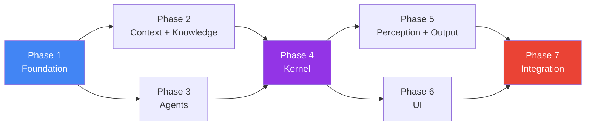

# Conclave — Implementation Plan

**Version:** 2.0
**Date:** July 11, 2026
**Status:** Approved
**Target:** Google DeepMind Bangalore Hackathon

---

## Overview

This document converts the Conclave architecture into a structured, milestone-driven implementation roadmap. Each phase has clear objectives, deliverables, acceptance criteria, dependencies, and expected outputs.

**Total estimated file count:** ~38 files
**Total phases:** 7
**Critical path:** Phase 1 → Phase 2 → Phase 4 → Phase 5 → Phase 7

Phases 3 and 6 can run in parallel with the critical path after their dependencies are met.

---

## Phase Dependency Graph



---

## Phase 1 — Foundation

### Objective

Establish the project skeleton, shared type system, event bus, and development toolchain. Every subsequent phase depends on this.

### Dependencies

None. This is the starting point.

### Deliverables

#### 1.1 Project Configuration

| File | Purpose |
|---|---|
| `package.json` | Project metadata, scripts (`dev`, `build`, `test`, `lint`), dependencies |
| `tsconfig.json` | TypeScript strict mode, path aliases (`@perception/*`, `@events/*`, `@context/*`, `@kernel/*`, `@agents/*`, `@output/*`, `@knowledge/*`, `@shared/*`) |
| `.eslintrc.json` | ESLint config with TypeScript rules, no-circular-dependency rule |
| `.prettierrc` | Code formatting (2-space indent, single quotes, trailing commas) |
| `.env.example` | Template for `GEMINI_API_KEY`, `GEMINI_MODEL`, `PORT` |
| `README.md` | Project overview with the one-sentence pitch |

**Dependencies (package.json):**

```json
{
  "dependencies": {
    "@google/generative-ai": "latest",
    "ws": "^8.x"
  },
  "devDependencies": {
    "typescript": "^5.x",
    "vitest": "^2.x",
    "@types/ws": "^8.x",
    "eslint": "^9.x",
    "@typescript-eslint/eslint-plugin": "latest",
    "@typescript-eslint/parser": "latest",
    "prettier": "^3.x"
  }
}
```

#### 1.2 Shared Types

| File | Contents |
|---|---|
| `src/shared/types.ts` | All type definitions: Perception types, Semantic Compressor types, Context types, Kernel types, Agent types, Blackboard types, Knowledge types, Output types |
| `src/shared/constants.ts` | Default thresholds, budget values, cooldown durations, similarity thresholds |
| `src/shared/errors.ts` | Custom error classes: `ConclaveError`, `PerceptionError`, `AgentError`, `ArbitrationError`, `BudgetExhaustedError` |
| `src/shared/logger.ts` | Structured logger with levels (debug, info, warn, error) + event logging capability (absorbed from event-logger) |
| `src/shared/id-generator.ts` | UUID v4 generation utility |
| `src/shared/similarity.ts` | Cosine similarity function for vector comparison (used by novelty calculator) |

#### 1.3 Event Bus

| File | Contents |
|---|---|
| `src/events/interfaces.ts` | `IEventBus`, `EventHandler<T>`, `Unsubscribe` |
| `src/events/event-types.ts` | `EventType` enum with all 24 event types |
| `src/events/event-schema.ts` | `EventPayloadMap` type mapping, `TypedEvent<T>`, `BaseEvent`, `AnySemanticEvent` |
| `src/events/event-bus.ts` | Implementation: typed publish/subscribe, `subscribeAll`, event logging via shared logger |
| `src/events/index.ts` | Barrel export |

### Acceptance Criteria

- [ ] `npm install` completes without errors
- [ ] `npx tsc --noEmit` passes with zero errors
- [ ] `npx vitest run` executes (even if no tests yet)
- [ ] EventBus can publish and subscribe to typed events
- [ ] EventBus enforces type safety: publishing `SPEAKER_STARTED` with wrong payload shape causes compile error
- [ ] All shared types compile and are importable from `@shared/types`
- [ ] Logger outputs structured JSON with timestamps and levels
- [ ] Cosine similarity function returns correct values for known vectors

### Expected Output

A compilable, linted, type-safe project skeleton where any developer can import types and publish/subscribe to events.

### Unit Tests

```
tests/unit/events/event-bus.test.ts
  ✓ publishes events to subscribers
  ✓ typed event payloads are enforced
  ✓ unsubscribe removes handler
  ✓ subscribeAll receives all event types
  ✓ multiple subscribers receive same event
  ✓ no cross-talk between event types

tests/unit/shared/similarity.test.ts
  ✓ identical vectors return 1.0
  ✓ orthogonal vectors return 0.0
  ✓ known vectors return expected similarity
```

---

## Phase 2 — Context Engine + Knowledge Graph

### Objective

Build the structured world model that maintains meeting state and the flat-array knowledge store. These are the "memory" of the system — all other modules read from them.

### Dependencies

- **Phase 1** (shared types, event bus)

### Deliverables

#### 2.1 Context Engine

| File | Contents |
|---|---|
| `src/context/interfaces.ts` | `IContextEngine`, `IContextStore`, `IContextProjector` |
| `src/context/context-store.ts` | In-memory `ContextState` with typed get/update methods |
| `src/context/context-engine.ts` | Orchestrator: handles `SemanticDelta`, routes to trackers, emits `context.updated`, produces Decision Graph |
| `src/context/context-projector.ts` | Deep-clones `ContextState` into frozen `ContextSnapshot` with unique ID and timestamp |
| `src/context/topic-tracker.ts` | Tracks current topic, detects topic changes, maintains topic history |
| `src/context/decision-tracker.ts` | Records decisions with supporting/opposing arguments, status transitions, produces `DecisionNode[]` for the Decision Graph |
| `src/context/assumption-tracker.ts` | Tracks assumptions with challenge status (active → challenged → validated → invalidated) |
| `src/context/risk-tracker.ts` | Tracks risks with severity and mitigation status |
| `src/context/index.ts` | Barrel export |

**Context Engine Event Subscriptions:**

| Subscribes To | Action |
|---|---|
| `delta.produced` | Route semantic units to appropriate trackers |
| `topic.changed` | Update topic tracker |
| `agent.finished` | Record intervention in context state |

**Context Engine Event Emissions:**

| Emits | When |
|---|---|
| `context.updated` | Any tracker modifies context state |

#### 2.2 Knowledge Graph

| File | Contents |
|---|---|
| `src/knowledge/interfaces.ts` | `IKnowledgeGraph` |
| `src/knowledge/knowledge-graph.ts` | Flat `KnowledgeEntry[]` array with `store()`, `getAll()`, `getByType()`, `getDecisionNodes()`, `export()` |
| `src/knowledge/index.ts` | Barrel export |

### Acceptance Criteria

- [ ] `ContextEngine.handleDelta()` correctly routes `SemanticUnit` types to appropriate trackers
- [ ] `ContextProjector.project()` returns a frozen deep clone (mutating the clone does not affect the store)
- [ ] `TopicTracker` correctly tracks topic transitions and history
- [ ] `DecisionTracker` produces `DecisionNode[]` with supporting and opposing arguments
- [ ] `AssumptionTracker` handles status transitions: active → challenged
- [ ] `RiskTracker` stores risks with severity levels
- [ ] `KnowledgeGraph.store()` appends entries, `getByType()` filters correctly
- [ ] All modules communicate only through `IContextEngine` / `IKnowledgeGraph` interfaces
- [ ] Context Engine emits `context.updated` events on the EventBus

### Expected Output

A fully functional world model that can ingest `SemanticDelta` objects and produce `ContextSnapshot` + `DecisionNode[]`.

### Unit Tests

```
tests/unit/context/context-engine.test.ts
  ✓ handles proposal semantic unit → creates decision entry
  ✓ handles assumption semantic unit → creates assumption entry
  ✓ handles risk semantic unit → creates risk entry
  ✓ handles topic change → updates current topic + history
  ✓ emits context.updated after handling delta

tests/unit/context/context-projector.test.ts
  ✓ snapshot is deeply frozen
  ✓ snapshot has unique ID and timestamp
  ✓ modifying snapshot does not affect store

tests/unit/context/decision-tracker.test.ts
  ✓ records decisions with status
  ✓ adds supporting arguments
  ✓ adds opposing arguments
  ✓ produces DecisionNode array

tests/unit/knowledge/knowledge-graph.test.ts
  ✓ stores entries
  ✓ retrieves by type
  ✓ produces decision nodes
  ✓ exports meeting record
```

---

## Phase 3 — Stakeholder Agents

### Objective

Build the agent framework and all four stakeholder agents. Each agent independently evaluates context + delta + blackboard state and returns an `AgentResult`.

### Dependencies

- **Phase 1** (shared types — `InterventionProposal`, `AgentResult`, `BlackboardEntry`)
- Does NOT depend on Phase 2 — agents receive data through function parameters, not by importing context

### Deliverables

#### 3.1 Agent Framework

| File | Contents |
|---|---|
| `src/agents/interfaces.ts` | `IStakeholderAgent`, `IInterventionScorer`, `IAgentRegistry` |
| `src/agents/base-agent.ts` | Abstract base class implementing shared logic: receives context+delta+blackboard, calls abstract `reason()` method, computes urge score, produces `AgentResult` |
| `src/agents/intervention-scorer.ts` | Implements `IInterventionScorer`: multiplicative urge formula, novelty calculation via cosine similarity, cost-of-interrupting computation |
| `src/agents/agent-registry.ts` | Implements `IAgentRegistry`: register/unregister agents, retrieve by ID or all |

#### 3.2 Stakeholder Agents

| File | Contents |
|---|---|
| `src/agents/cto-agent.ts` | CTO agent: architecture, scalability, implementation feasibility, engineering effort |
| `src/agents/product-agent.ts` | Product agent: user value, feature scope, UX, product strategy |
| `src/agents/finance-agent.ts` | Finance agent: ROI, pricing, infrastructure cost, burn rate |
| `src/agents/research-agent.ts` | Research agent: external validation, competitor analysis, market research. Calls Gemini Search inline. |
| `src/agents/index.ts` | Barrel export |

#### 3.3 Agent Evaluation Flow (inside `base-agent.ts`)

```
1. Receive (ContextSnapshot, SemanticDelta, BlackboardState)
2. Call Gemini with structured prompt:
   - Role + responsibilities
   - Context snapshot (compressed)
   - Semantic delta (what just happened)
   - Blackboard state (what other agents think)
   - Required output: relevance, severity, confidence, informationGain,
     timeCriticality, shouldIntervene, reason, recommendation,
     blackboard observations
3. Parse structured output
4. Compute novelty via intervention-scorer
5. Compute cost of interrupting via intervention-scorer
6. Compute urge via intervention-scorer
7. If urge < threshold: return { proposal: null, blackboardEntries: [...] }
8. If urge ≥ threshold: return { proposal: InterventionProposal, blackboardEntries: [...] }
```

#### 3.4 Agent Prompt Template

```
You are the {ROLE} stakeholder in a real-time technical discussion.

## Your Responsibilities
{RESPONSIBILITIES}

## Current Meeting Context
- Objective: {objective}
- Current Topic: {currentTopic}
- Phase: {meetingPhase}
- Active Assumptions: {assumptions}
- Decisions Made: {decisions}
- Open Risks: {risks}

## What Just Happened (Semantic Delta)
{delta.units formatted}

## What Other Stakeholders Have Observed (Blackboard)
{blackboardEntries formatted}

## Your Previous Interventions
{last 3 interventions}

## Task
Evaluate whether you should intervene. Respond with JSON:
{
  "relevance": <0-1>,
  "severity": <0-1>,
  "confidence": <0-1>,
  "informationGain": <0-1>,
  "timeCriticality": <0-1>,
  "shouldIntervene": <boolean>,
  "reason": "<one-line justification>",
  "recommendation": "<what you would say — 2-3 sentences max>",
  "observations": [
    { "type": "observation|warning|hypothesis|question|confidence_update|agreement|disagreement",
      "content": "<one sentence>",
      "confidence": <0-1>,
      "relatedTo": "<id of blackboard entry this responds to, or null>" }
  ]
}
```

### Acceptance Criteria

- [ ] `BaseAgent` correctly orchestrates: LLM call → parse → score → produce `AgentResult`
- [ ] `InterventionScorer.calculateUrge()` returns 0 when any multiplicative factor is 0
- [ ] `InterventionScorer.calculateUrge()` returns higher scores for more critical interventions
- [ ] `InterventionScorer.calculateNovelty()` returns 0 for identical previous interventions
- [ ] `InterventionScorer.calculateNovelty()` returns 1 for completely novel interventions
- [ ] All four agents extend `BaseAgent` and define role-specific prompts
- [ ] `AgentRegistry` correctly registers, unregisters, and retrieves agents
- [ ] Agents return `BlackboardEntry[]` as part of `AgentResult` even when proposal is null
- [ ] Research Agent can call Gemini Search during evaluation (when available)
- [ ] Agents handle Gemini API errors gracefully (return null proposal, log error)

### Expected Output

Four independently testable agents that can evaluate any `ContextSnapshot + SemanticDelta + BlackboardState` and return structured `AgentResult`.

### Unit Tests

```
tests/unit/agents/intervention-scorer.test.ts
  ✓ multiplicative formula zeroes out with any zero factor
  ✓ higher severity increases urge
  ✓ higher cost of interrupting decreases urge
  ✓ novelty = 0 for identical interventions
  ✓ novelty = 1 for novel interventions
  ✓ cost-of-interrupting has minimum floor of 0.1

tests/unit/agents/base-agent.test.ts
  ✓ returns null proposal when urge below threshold
  ✓ returns proposal when urge above threshold
  ✓ always returns blackboard entries regardless of proposal
  ✓ handles LLM errors gracefully

tests/unit/agents/agent-registry.test.ts
  ✓ registers and retrieves agents
  ✓ unregisters agents
  ✓ returns all registered agents
```

---

## Phase 4 — Cognitive Kernel

### Objective

Build the brain of the system: the Cognitive Tick loop, Cognitive Blackboard, Cognitive Scheduler, Proposal Pool, Arbitrator, Attention Budget, and Attention Gate.

### Dependencies

- **Phase 2** (Context Engine — Kernel reads snapshots)
- **Phase 3** (Agents — Kernel dispatches to agents)
- **Phase 1** (Event Bus, types)

### Deliverables

#### 4.1 Kernel Core

| File | Contents |
|---|---|
| `src/kernel/interfaces.ts` | `ICognitiveKernel`, `ICognitiveScheduler`, `IProposalPool`, `IArbitrator`, `IAttentionBudget`, `IAttentionGate`, `ICognitiveBlackboard` |
| `src/kernel/cognitive-kernel.ts` | Main kernel: manages lifecycle (idle → running → stopped), executes Cognitive Tick on each `delta.produced` event, records tick history |
| `src/kernel/cognitive-scheduler.ts` | Dispatches `ContextSnapshot + SemanticDelta + BlackboardState` to all registered agents in parallel (via `Promise.allSettled`), collects `AgentResult[]` |
| `src/kernel/proposal-pool.ts` | Collects `InterventionProposal` objects from agent results per tick, flushes after arbitration |
| `src/kernel/arbitrator.ts` | Evaluates proposals: threshold filter → Blackboard convergence bonus → deduplication → budget check → cooldown check → flow protection → rank → select winner |
| `src/kernel/attention-budget.ts` | Manages budget: `canInterrupt()`, `consume()`, `replenish()`, dynamic threshold adjustment, cooldown state |
| `src/kernel/attention-gate.ts` | Issues `SpeakingToken` objects, tracks current speaker, enforces max duration, revokes tokens |
| `src/kernel/blackboard.ts` | Implements `ICognitiveBlackboard`: `post()`, `read()`, `getState()`, `clear()` |
| `src/kernel/index.ts` | Barrel export |

#### 4.2 Cognitive Tick Implementation

```typescript
async executeTick(triggerEvent: AnySemanticEvent, delta: SemanticDelta): Promise<CognitiveTick> {
  const tickId = generateId();
  const tickStart = Date.now();

  // 1. Update context
  this.contextEngine.handleDelta(delta);

  // 2. Create snapshot
  const snapshot = this.contextEngine.getSnapshot();

  // 3. Read blackboard (from previous ticks)
  const blackboardState = this.blackboard.getState();

  // 4. Dispatch to all agents in parallel
  const agentResults = await this.scheduler.dispatch(snapshot, delta, blackboardState);

  // 5. Post new blackboard entries
  for (const result of agentResults) {
    for (const entry of result.blackboardEntries) {
      this.blackboard.post({ ...entry, tickId });
    }
  }

  // 6. Collect proposals
  const proposals = agentResults
    .map(r => r.proposal)
    .filter((p): p is InterventionProposal => p !== null);

  // 7. Arbitrate
  const arbitrationResult = this.arbitrator.evaluate(proposals, blackboardState);

  // 8. Execute result
  if (arbitrationResult.granted) {
    const token = this.attentionGate.grant(
      arbitrationResult.granted.agentId,
      arbitrationResult.granted
    );
    const agent = this.agentRegistry.getAgent(arbitrationResult.granted.agentId)!;
    const response = await agent.generateResponse(snapshot, arbitrationResult.granted);
    await this.speechOutput.speak(response, token);
    this.attentionBudget.consume(arbitrationResult.granted.interruptCost);
  }

  // 9. Store in knowledge graph
  this.storeResults(arbitrationResult);

  // 10. Record tick
  const tick: CognitiveTick = {
    tickId,
    triggerEvent,
    compressedDelta: delta,
    contextSnapshot: snapshot,
    blackboardState,
    proposals,
    arbitrationResult,
    durationMs: Date.now() - tickStart,
    timestamp: tickStart,
  };

  this.tickHistory.push(tick);
  this.eventBus.publish({ type: EventType.TICK_COMPLETED, payload: { tick } });

  return tick;
}
```

#### 4.3 Arbitration Rules (in order)

| Step | Rule | Action |
|---|---|---|
| 1 | **Threshold filter** | Drop proposals with `urgency < 0.3` |
| 2 | **Convergence bonus** | For each proposal, check if ≥2 Blackboard entries from different agents relate to the same topic. Add `0.15 × converging_agent_count` to urgency. |
| 3 | **Deduplication** | If two proposals have cosine similarity > 0.85 on their recommendation text, keep the higher-urgency one |
| 4 | **Budget check** | If `attentionBudget.canInterrupt() === false`, defer all proposals |
| 5 | **Cooldown check** | If the winning agent intervened within the last 60 seconds, select next-ranked |
| 6 | **Flow protection** | If speaker is in flow (no pause > 500ms in last 10s) AND urgency < 0.75, defer |
| 7 | **Select winner** | Highest `finalUrge`. Grant via Attention Gate. Reject rest. |

#### 4.4 Attention Budget Mechanics

```
Initial: 100 units

Consumption per interruption:
  base_cost (10) + estimatedSpeakingTime_factor

Replenishment:
  +5 units per minute of uninterrupted human discussion

Dynamic threshold:
  After each interruption: threshold += 0.05
  After 2 min silence: threshold -= 0.02 (floor: 0.3)

Cooldown:
  When budget ≤ 0: enter cooldown for 30 seconds
  During cooldown: all proposals deferred
  After cooldown: budget replenishes to 20 units
```

### Acceptance Criteria

- [ ] Cognitive Tick executes all 10 steps in deterministic order
- [ ] Tick completes in < 5 seconds for 4 agents (mocked LLM calls)
- [ ] Blackboard entries from tick N are only visible in tick N+1
- [ ] Arbitrator correctly applies all 7 rules in order
- [ ] Convergence bonus increases urgency when multiple agents converge
- [ ] Attention Budget depletes on consumption and replenishes over time
- [ ] Attention Budget enters cooldown when depleted
- [ ] Attention Gate issues exactly one token at a time
- [ ] Rejected proposals are stored in Knowledge Graph
- [ ] `tick.started` and `tick.completed` events are emitted
- [ ] Tick history is queryable

### Expected Output

A fully functional Cognitive Kernel that can receive `SemanticDelta` events, execute the full cognition cycle, and produce arbitrated outputs.

### Unit Tests

```
tests/unit/kernel/cognitive-kernel.test.ts
  ✓ executes tick steps in correct order
  ✓ records tick in history
  ✓ emits tick.started and tick.completed events

tests/unit/kernel/arbitrator.test.ts
  ✓ drops proposals below threshold
  ✓ applies convergence bonus
  ✓ deduplicates similar proposals
  ✓ respects attention budget
  ✓ enforces agent cooldown
  ✓ raises threshold for speaker-in-flow
  ✓ selects highest urgency winner

tests/unit/kernel/attention-budget.test.ts
  ✓ initializes with configured budget
  ✓ canInterrupt returns true when budget available
  ✓ canInterrupt returns false when depleted
  ✓ consume reduces remaining budget
  ✓ replenish increases budget over time
  ✓ enters cooldown at zero
  ✓ dynamic threshold increases after interruptions

tests/unit/kernel/blackboard.test.ts
  ✓ posts entries
  ✓ reads entries with filters
  ✓ getState returns frozen array
  ✓ entries include tick ID

tests/integration/cognitive-tick.test.ts
  ✓ full tick with mock agents: delta → context → blackboard → proposals → arbitration → result
```

---

## Phase 5 — Perception Engine + Speech Output

### Objective

Build the input (Gemini Live → transcript → semantic compression) and output (agent response → TTS) layers.

### Dependencies

- **Phase 4** (Kernel — Perception feeds events to Kernel, Speech Output is called by Kernel)
- **Phase 1** (Event Bus, types)

### Deliverables

#### 5.1 Perception Engine

| File | Contents |
|---|---|
| `src/perception/interfaces.ts` | `IPerceptionEngine`, `IGeminiLiveConnector`, `ITranscriptProcessor`, `IDiarizationTracker`, `IPauseDetector`, `ISemanticCompressor` |
| `src/perception/perception-engine.ts` | Orchestrator: manages lifecycle, coordinates transcript processing, batches segments for compression, emits `delta.produced` |
| `src/perception/gemini-live-connector.ts` | WebSocket client for Gemini Live API: connect, disconnect, stream audio, receive transcripts |
| `src/perception/transcript-processor.ts` | Converts `RawTranscript` into `TranscriptSegment` with speaker and timing metadata |
| `src/perception/diarization-tracker.ts` | Assigns speaker labels to segments, tracks speaker history |
| `src/perception/pause-detector.ts` | Monitors audio metrics for silence, classifies pauses (brief/natural/extended) |
| `src/perception/semantic-compressor.ts` | Calls Gemini with structured output to compress transcript batch into `SemanticDelta` containing `SemanticUnit[]` |
| `src/perception/index.ts` | Barrel export |

**Semantic Compressor Prompt:**

```
You are a semantic compressor for a technical meeting.

Given this transcript segment from {speaker}, extract ONLY the meaningful semantic units.
Do NOT summarize. Extract structured meaning.

Transcript: "{rawText}"

Respond with JSON:
{
  "units": [
    {
      "type": "proposal|decision|assumption|risk|question|objection|clarification|statement|agreement",
      "content": "<one sentence — the extracted meaning>",
      "confidence": <0-1>,
      "domain": "architecture|product|finance|research|null"
    }
  ],
  "topicShift": <boolean>,
  "newTopic": "<new topic if shifted, else null>"
}
```

#### 5.2 Speech Output

| File | Contents |
|---|---|
| `src/output/interfaces.ts` | `ISpeechOutput`, `IResponseFormatter` |
| `src/output/speech-synthesizer.ts` | Uses Gemini TTS API to convert `AgentResponse` text into audio, streams to client |
| `src/output/response-formatter.ts` | Formats `AgentResponse` into `FormattedResponse` (SSML for speech, markdown for UI) |
| `src/output/index.ts` | Barrel export |

### Acceptance Criteria

- [ ] Gemini Live Connector establishes WebSocket connection and receives transcripts
- [ ] Transcript Processor produces `TranscriptSegment` with correct structure
- [ ] Diarization Tracker assigns consistent speaker labels
- [ ] Pause Detector correctly classifies silence durations
- [ ] Semantic Compressor calls Gemini API and returns valid `SemanticDelta`
- [ ] Perception Engine batches segments and triggers compression at appropriate intervals
- [ ] Perception Engine emits `delta.produced` events on the EventBus
- [ ] Speech Synthesizer converts text to audio via Gemini TTS
- [ ] Response Formatter produces valid SSML and markdown
- [ ] Error handling: Gemini API failures are caught and logged without crashing

### Expected Output

Working input and output pipelines: audio → transcript → semantic delta → events, and agent response → speech.

### Unit Tests

```
tests/unit/perception/semantic-compressor.test.ts
  ✓ compresses proposal transcript into proposal semantic unit
  ✓ compresses multi-concept transcript into multiple units
  ✓ detects topic shift
  ✓ handles Gemini API errors gracefully

tests/unit/perception/pause-detector.test.ts
  ✓ classifies brief pauses (< 500ms)
  ✓ classifies natural pauses (500-2000ms)
  ✓ classifies extended pauses (> 5000ms)

tests/unit/output/response-formatter.test.ts
  ✓ produces valid SSML
  ✓ produces valid markdown
  ✓ preserves agent role in formatted output
```

---

## Phase 6 — User Interface

### Objective

Build the web-based observation interface that makes AI cognition visible. The Attention Budget gauge is the visual centerpiece.

### Dependencies

- **Phase 4** (Kernel — UI subscribes to kernel events via EventBus → WebSocket)
- **Phase 1** (Event Bus, types)

### Deliverables

#### 6.1 UI Infrastructure

| File | Contents |
|---|---|
| `src/ui/index.html` | Main HTML shell with semantic structure, Google Fonts, panel layout |
| `src/ui/app.ts` | Application entry: WebSocket connection, event routing to components |
| `src/ui/websocket-client.ts` | Client-side WebSocket that receives events and distributes to UI components |
| `src/ui/styles/variables.css` | Design tokens: colors (dark theme), typography (Inter/Outfit), spacing, shadows, transitions |
| `src/ui/styles/main.css` | Global styles, layout grid, panel styling, animations |

#### 6.2 UI Components

| File | Visual Element |
|---|---|
| `src/ui/components/transcript-panel.ts` | Live transcript with speaker labels, color-coded by speaker. New text flows in with subtle fade animation. |
| `src/ui/components/context-panel.ts` | Current topic, assumptions, decisions, risks. Updates in real-time as context changes. |
| `src/ui/components/stakeholder-panel.ts` | 4 agent cards showing: name, role, status (idle/thinking/speaking), last intervention time. Status transitions animate. |
| `src/ui/components/attention-budget-gauge.ts` | **VISUAL CENTERPIECE.** Large horizontal gauge bar. Animated depletion on interruption. Color transitions: green → yellow → red → empty. Shows percentage, interruption count, threshold, and cooldown timer. |
| `src/ui/components/blackboard-panel.ts` | Shows Blackboard entries grouped by tick. Color-coded by entry type. Shows agent attribution. New entries animate in. Convergence highlighted. |
| `src/ui/components/decision-graph-panel.ts` | Renders Decision Graph: decisions with supporting/opposing arguments, linked agents. Tree or graph layout. |
| `src/ui/components/interrupt-queue.ts` | Shows pending, granted, and rejected proposals. Granted proposals highlight with the agent's color. |

#### 6.3 UI Layout

```
┌──────────────────────────────────────────────────────────────────┐
│  CONCLAVE — Cognitive Operating System            [● Meeting Active]│
├──────────────────────────┬───────────────────────────────────────┤
│                          │                                       │
│   LIVE TRANSCRIPT        │   ATTENTION BUDGET                    │
│                          │   ████████████████████████░░░░  87%   │
│   [Speaker 1]: "We       │   Interruptions: 2  Threshold: 0.40  │
│    should consider..."   │                                       │
│                          ├───────────────────────────────────────┤
│   [Speaker 2]: "What     │                                       │
│    about the cost..."    │   STAKEHOLDERS                        │
│                          │   ┌─────┐ ┌─────┐ ┌─────┐ ┌─────┐   │
│                          │   │ CTO │ │PROD │ │ FIN │ │ RES │   │
│                          │   │idle │ │think│ │idle │ │idle │   │
│                          │   └─────┘ └─────┘ └─────┘ └─────┘   │
│                          ├───────────────────────────────────────┤
│                          │                                       │
│                          │   COGNITIVE BLACKBOARD                │
│                          │   ─────────────────────               │
│                          │   [CTO] ⚠ "Migration requires 3-6m"  │
│                          │   [RES] 💡 "Serverless may be cheaper"│
│                          │   [FIN] 📊 "ROI negative if >4 months"│
│                          │                                       │
├──────────────────────────┼───────────────────────────────────────┤
│                          │                                       │
│   DECISION GRAPH         │   INTERVENTION LOG                    │
│                          │                                       │
│   ◉ Use Kubernetes       │   ✅ CTO (2m ago) — urgency: 0.78    │
│   ├── ✓ Scales well      │   ❌ Finance — outranked              │
│   ├── ✗ Team lacks exp   │   ⏸ Research — deferred               │
│   └── ✗ ROI uncertain    │                                       │
│                          │                                       │
└──────────────────────────┴───────────────────────────────────────┘
```

#### 6.4 Design Specifications

- **Theme:** Dark mode (background: `#0a0a0f`, panels: `#12121a`, accent: `#7c3aed`)
- **Typography:** Inter for body, Outfit for headings (Google Fonts)
- **Accent colors per agent:** CTO: `#3b82f6`, Product: `#10b981`, Finance: `#f59e0b`, Research: `#8b5cf6`
- **Animations:** Attention Budget gauge uses CSS transitions (500ms ease-out). Agent status transitions use 200ms fade. New transcript entries slide in from bottom.
- **Glassmorphism:** Panel backgrounds with `backdrop-filter: blur(12px)` and subtle borders
- **Budget gauge:** CSS custom properties for fill width, gradient from green→yellow→red based on percentage

### Acceptance Criteria

- [ ] UI renders all 7 panels in the defined layout
- [ ] Attention Budget gauge animates smoothly on budget changes
- [ ] Stakeholder cards show correct status transitions (idle → thinking → speaking)
- [ ] Blackboard entries appear in real-time, grouped by tick
- [ ] Decision Graph renders decisions with supporting/opposing arguments
- [ ] Transcript scrolls with new entries
- [ ] WebSocket connection establishes and receives events
- [ ] Dark theme with glassmorphism aesthetics
- [ ] Responsive — works at 1280px+ width
- [ ] No visible layout jank or broken states

### Expected Output

A stunning, dark-themed observation interface that makes AI cognition visible.

---

## Phase 7 — Integration + Bootstrap

### Objective

Wire everything together. The application bootstrap creates all modules, connects them via the EventBus, and runs the system end-to-end.

### Dependencies

- **All previous phases**

### Deliverables

#### 7.1 Bootstrap

| File | Contents |
|---|---|
| `src/index.ts` | Application entry point: creates all modules in dependency order, wires subscriptions, starts perception, serves UI |
| `src/config.ts` | Centralized configuration: reads `.env`, provides defaults, exports typed config objects |

#### 7.2 WebSocket Server

`src/index.ts` also starts a WebSocket server that:
- Subscribes to all EventBus events
- Forwards relevant events to connected UI clients
- Handles client connections/disconnections

#### 7.3 Bootstrap Sequence

```typescript
// src/index.ts

async function bootstrap() {
  // 1. Load configuration
  const config = loadConfig();

  // 2. Initialize Event Bus
  const eventBus = new EventBus();

  // 3. Initialize Knowledge Graph
  const knowledgeGraph = new KnowledgeGraph();

  // 4. Initialize Context Engine
  const contextEngine = new ContextEngine(eventBus);

  // 5. Initialize Cognitive Blackboard
  const blackboard = new CognitiveBlackboard();

  // 6. Initialize Agents
  const agentRegistry = new AgentRegistry();
  agentRegistry.register(new CTOAgent(config.gemini));
  agentRegistry.register(new ProductAgent(config.gemini));
  agentRegistry.register(new FinanceAgent(config.gemini));
  agentRegistry.register(new ResearchAgent(config.gemini));

  // 7. Initialize Kernel Components
  const attentionBudget = new AttentionBudget(config.meeting.attentionBudget);
  const attentionGate = new AttentionGate();
  const proposalPool = new ProposalPool();
  const arbitrator = new Arbitrator(attentionBudget);
  const scheduler = new CognitiveScheduler(agentRegistry);

  // 8. Initialize Speech Output
  const speechOutput = new SpeechSynthesizer(config.gemini);

  // 9. Initialize Cognitive Kernel
  const kernel = new CognitiveKernel({
    eventBus,
    contextEngine,
    blackboard,
    scheduler,
    proposalPool,
    arbitrator,
    attentionBudget,
    attentionGate,
    speechOutput,
    knowledgeGraph,
    agentRegistry,
  });

  // 10. Initialize Perception Engine
  const perceptionEngine = new PerceptionEngine({
    eventBus,
    config: config.perception,
  });

  // 11. Start WebSocket server for UI
  startWebSocketServer(eventBus, config.port);

  // 12. Start the system
  await kernel.start(config.meeting);
  await perceptionEngine.start(config.perception.session);

  // 13. Emit meeting.started
  eventBus.publish({
    type: EventType.MEETING_STARTED,
    payload: {
      meetingId: config.meeting.meetingId,
      objective: config.meeting.objective,
      participants: config.meeting.participants,
      config: config.meeting,
    },
  });

  console.log('Conclave is running.');
}
```

### Acceptance Criteria

- [ ] Application starts without errors
- [ ] All modules are initialized in correct dependency order
- [ ] EventBus connects all producers and consumers
- [ ] Gemini Live connection is established
- [ ] Speaking into microphone produces transcript → semantic delta → context update
- [ ] Agents evaluate context and produce proposals
- [ ] Arbitration selects winner (or correctly rejects all)
- [ ] Granted agent speaks via TTS
- [ ] UI displays all state changes in real-time
- [ ] Attention Budget depletes and replenishes correctly
- [ ] Blackboard accumulates entries across ticks
- [ ] Decision Graph populates with decisions and evidence

### Integration Tests

```
tests/integration/intervention-flow.test.ts
  ✓ semantic delta with assumption → agent proposes → arbitration grants → speech output called

tests/integration/blackboard-collaboration.test.ts
  ✓ tick N: agents post observations
  ✓ tick N+1: agents see observations and build on them
  ✓ convergence bonus applied when ≥2 agents converge

tests/integration/cognitive-tick.test.ts
  ✓ full tick from delta to arbitration result
  ✓ tick history records all ticks
  ✓ tick.completed event contains full tick data
```

---

## Phase Summary

| Phase | Objective | Files | Critical Path? |
|---|---|---|---|
| 1 | Foundation (types, events, toolchain) | 12 | ✅ Yes |
| 2 | Context Engine + Knowledge Graph | 10 | ✅ Yes |
| 3 | Stakeholder Agents | 9 | Parallel with Phase 2 |
| 4 | Cognitive Kernel | 9 | ✅ Yes |
| 5 | Perception + Output | 9 | ✅ Yes |
| 6 | UI | 10 | Parallel with Phase 5 |
| 7 | Integration + Bootstrap | 2 | ✅ Yes |
| **Total** | | **~38 + tests** | |

---

## Risk Mitigation Per Phase

| Phase | Risk | Mitigation |
|---|---|---|
| 1 | None — pure setup | N/A |
| 2 | Context model too complex | Start with minimal trackers (topic + decision + assumption). Add risk tracker only if time permits. |
| 3 | Agent LLM calls too slow | Implement timeout (3s). Return null proposal on timeout. Reduce prompt size. |
| 4 | Tick takes too long | Profile. Most time is in agent evaluation (Phase 3). Ensure parallel dispatch. |
| 5 | Gemini Live API issues | Build a mock Gemini connector that replays pre-recorded transcript. Use for testing. Switch to real API for demo. |
| 6 | UI polish takes too long | Prioritize: Attention Budget gauge > Blackboard > Stakeholder status > Transcript > Decision Graph. |
| 7 | Integration issues | Each phase has its own tests. Integration tests catch wiring bugs early. |
